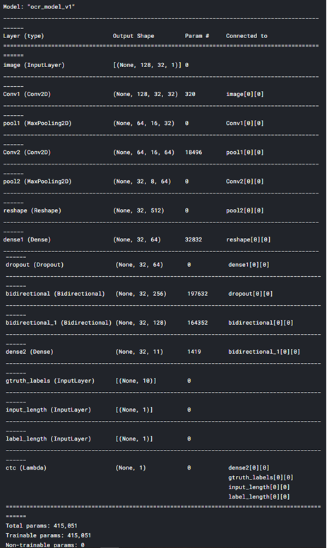

# Multi-handwritten-digit-recognition-CRNN-CTC-loss

Here I have trained a simple model with CRNN + CTC loss for multi handwritten digit recognition. 

You can find the Kaggle notebook [**HERE**](https://www.kaggle.com/bomaich/simple-multi-digit-recognition-mnist#Predict-on-some-test-image) 
or you can use `simple-multi-digit-recognition-mnist.ipynb`

<i>Hình 1. Model.summary </i>

The dataset I'm using is the dataset that I created myself [here](https://github.com/mrzaizai2k/Multi-digit-images-generator-MNIST-)

I prepared file `.py` if you need as well

You can see the result:

<i>Hình 2. Resulty </i>

